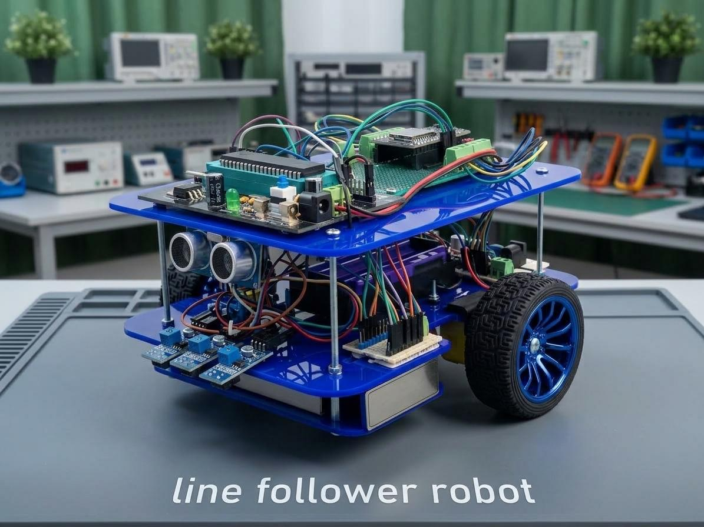
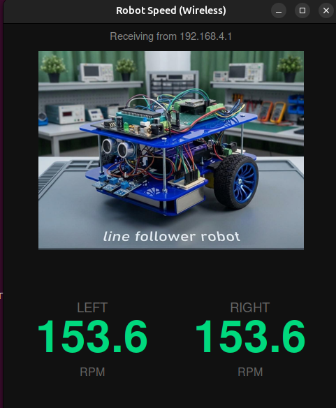

<div align="center">

# 🤖 PS4-Controlled & Autonomous Line-Following Robot

**A differential-drive robot built on ROS 2 Jazyy + ESP32 — drive it manually with a PS4 controller, or flip a single button and watch it follow a line on its own.**




</div>

<br/>

## ✨ Highlights

| | |
|---|---|
| 🎮 | **Manual driving** with a PS4 controller over ROS 2's `joy` + `teleop_twist_joy` |
| 📡 | **Dual link to the ESP32** — WiFi (UDP, self-hosted AP) *or* USB Serial, both accepted at once |
| ⚙️ | **Closed-loop PID speed control** on both wheels via quadrature encoders |
| 🪶 | **Smooth acceleration ramping** — no jerks, no wheelies |
| 🛣️ | **Autonomous line following** driven by an AVR reading 3 analog IR sensors |
| 🛑 | **Obstacle detection** that halts the robot instantly |
| 🔘 | **One-button mode switch** — Manual ⇄ Line-Follow, live, from the controller |
| 🐕 | **Safety watchdogs** on both the WiFi/Serial link and the AVR sensor link |
| 📊 | **Live wireless speed dashboard** for both wheels |

<div align="center">

</div>

<br/>

## 📋 Table of Contents

- [Hardware](#-hardware)
- [System Architecture](#-system-architecture)
- [Repository Contents](#-repository-contents)
- [Setup](#-setup)
- [Running It](#-running-it)
- [Tuning Notes](#-tuning-notes)
- [Roadmap](#-roadmap)

<br/>

## 🔧 Hardware

| Component | Role |
|---|---|
| ESP32 DevKit | Main controller — motor PID, WiFi AP, mode switching |
| AVR MCU (8 MHz, bare-metal AVR-GCC) | Reads 3 analog IR sensors, computes line-position error, streams it over UART |
| 2× GA25-370 DC gear motors (12 V, with encoders) | Drive wheels |
| L293D motor driver | Drives both motors — PWM applied directly on the IN pins (ENA/ENB tied to 5 V) |
| PS4 (DualShock 4) controller | Manual driving input, paired over Bluetooth |
| Laptop / Raspberry Pi 4 (ROS 2 Jazzy) | Runs `joy_node`, `teleop_twist_joy`, and the ESP32 bridge node |

<br/>

## 🗺️ System Architecture

```
PS4 Controller (Bluetooth)
        │
    joy_node   ──▶  /joy
        │
teleop_twist_joy  ──▶  /cmd_vel
        │
  bridge node (WiFi UDP  or  USB Serial)
        │
        ▼
      ESP32   ◀── UART ──   AVR (3× IR sensors)
        │
  PID + Encoders
        │
     L293D  ──▶  DC Motors
```

- **MANUAL mode** → the ESP32 drives the wheels from commands received over WiFi/Serial.
- **LINE_FOLLOW mode** → manual commands are ignored; the ESP32 steers using the position error streamed continuously by the AVR.
- Both modes share the same PID + encoder feedback loop for actually reaching the requested wheel speed.

<br/>

## 📁 Repository Contents

| File | Description |
|---|---|
| `main.cpp` | ESP32 firmware — WiFi AP, UDP + Serial command handling, PID motor control, encoder reading, line-follow mode, obstacle stop |
| `avr_line_sensor.c` | Bare-metal AVR-GCC firmware — reads 3 analog IR sensors, computes the line-position error, sends it over UART |
| `wifi_bridge.py` | ROS 2 node — converts `/cmd_vel` to wheel speeds and sends them to the ESP32 over WiFi UDP; also forwards a mode-toggle command from a controller button |
| `serial_bridge.py` | Same as above, but over USB Serial instead of WiFi |
| `ps4_config.yaml` | `teleop_twist_joy` configuration mapping the PS4 controller's axes/buttons |

<br/>

## 🚀 Setup

1. Flash `avr_line_sensor.c` to the AVR board (built for an 8 MHz clock).
2. Flash `main.cpp` to the ESP32 via PlatformIO/Arduino IDE.
3. Wire the AVR's UART TX to the ESP32's UART2 RX (GPIO 16), with a **common ground**.
4. On the laptop/Pi, install ROS 2 Jazzy and the required packages:
   ```bash
   sudo apt install ros-jazzy-joy ros-jazzy-teleop-twist-joy python3-serial
   ```
5. Pair the PS4 controller over Bluetooth.

<br/>

## ▶️ Running It

```bash
# Terminal 1
ros2 run joy joy_node

# Terminal 2
ros2 run teleop_twist_joy teleop_node --ros-args --params-file ps4_config.yaml

# Terminal 3 — pick one link method
python3 wifi_bridge.py     # connect to the "CarRobotPS4" WiFi network first
# or
python3 serial_bridge.py   # connect the ESP32 over USB
```

Drive the robot manually onto the line, then press the assigned controller button to switch into autonomous line-following mode. Press it again to take back manual control at any time.

<br/>

## 🎛️ Tuning Notes

- `Kp`, `Ki`, `Kd` in `main.cpp` control the wheel-speed PID loop.
- `LINE_KP` and `LINE_BASE_RPM` control how aggressively and how fast the robot follows the line.
- `MAX_TARGET_RPM` should match the motors' real achievable speed under load, not just their no-load datasheet rating.

<br/>

## 🗺️ Roadmap

- [ ] Move the WiFi bridge from a laptop to an onboard Raspberry Pi for a fully self-contained robot
- [ ] Add a physical on/off switch for line-follow mode as a hardware-only fallback
- [ ] Migrate the ESP32 link to ESP-NOW for longer, more reliable range than WiFi AP mode

<br/>

<div align="center">

Made with ⚙️, 🔧 and a lot of debugging.

</div>
